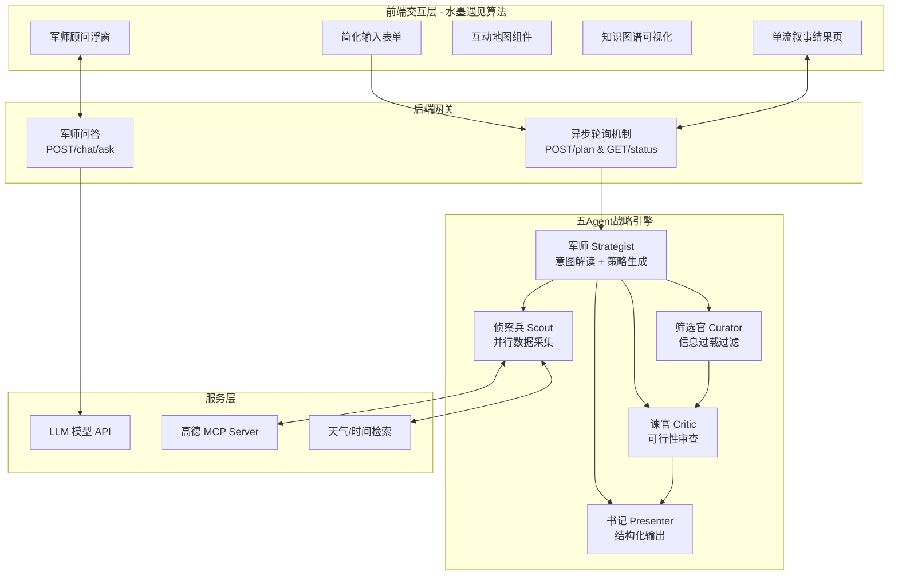

# 云游策 (CloudStrategy) - AI 文旅智能体

> **以云端之智，成脚下之路。让每一次出发，都如古人般洒脱，亦如未来般精准。**

<p align="center">
  
  
  
  
  
  
</p>

## 项目简介

**云游策 (CloudStrategy)** 是一款革新性的 AI 文旅智能体，专为终结现代旅行中的"信息过载"与"决策疲劳"而生。

其名寓含双重智慧：
- **"云游"**：承袭古人逍遥天地、随心而行的雅趣，致力于让用户从繁琐的攻略中解脱，重获自在云游的纯粹体验
- **"策"**：依托强大的云端算力与人工智能算法，化身用户的私人军师，在海量数据中运筹帷幄，精准生成最优行程策略

### 核心亮点

* **五 Agent 战略协作**: 军师、侦察兵、筛选官、谏官、书记五位 Agent 协同运筹，从意图解读到策略生成，真正实现"策"的能力
* **终结信息过载**: 筛选官按相关性评分过滤海量景点，只呈现最适合你的选项
* **终结决策疲劳**: 军师生成 2-3 个策略方案（经典路线/省钱攻略/深度体验），附带利弊分析，选择不再纠结
* **水墨遇见算法**: 融合东方水墨写意与现代精准数据的设计语言，视觉体验独特
* **高德互动地图**: 深度集成高德地图 JS API 2.0，动态绘制真实经纬度打卡路线
* **预算明细面板**: 智能汇总门票、餐饮、住宿与交通等多维度花销，预算尽在掌握
* **知识图谱可视化**: 将行程数据转换为节点关系图，直观展示行程结构
* **军师伴游问答**: 悬浮式 AI 问答窗口，拥有完整行程上下文，提供有见地的策略建议

## 系统架构



## 核心功能

### 1. 战略级行程规划

不同于传统的"数据搬运"，云游策的五 Agent 引擎真正实现"策"的能力：

1. **意图解读**: 军师分析用户输入（支持模糊输入），推断偏好和约束
2. **数据采集**: 侦察兵并行搜索景点、天气、酒店数据
3. **信息过滤**: 筛选官按相关性评分过滤，解决"信息过载"
4. **策略生成**: 军师生成 2-3 个方案变体，附带利弊分析，解决"决策疲劳"
5. **可行性审查**: 谏官检查行程可行性，标注风险
6. **结构化输出**: 书记格式化最终行程策略

### 2. 异步轮询任务系统

针对 LLM 生成超长文本的 504 Gateway Timeout 问题：

* **`POST /api/trip/plan`**: 立即返回 `task_id`，推理任务后台执行
* **`GET /api/trip/status/{task_id}`**: 前端每 3 秒轮询，实时获取进度

### 3. 军师伴游问答

AI 聊天不再是一个中立的信息查询工具，而是一位有见地的旅行军师：
- 主动提供策略建议（"我建议..."、"如果是我会..."）
- 适时提醒潜在问题（天气、人流、体力等）
- 给出明确的推荐理由，而非罗列信息

## 快速部署

### 环境准备

* Python 3.10+
* Node.js 18+
* 大模型 API Key（兼容 OpenAI 格式）
* 高德地图 API Key（Web服务 + Web端(JS API)）
* Unsplash API Key

### 后端启动

```bash
cd backend
python -m venv venv
source venv/bin/activate  # Windows: venv\Scripts\activate
pip install -r requirements.txt

# 配置环境变量
cp .env.example .env
# 填入 LLM_API_KEY, LLM_BASE_URL, LLM_MODEL_ID
# 填入 VITE_AMAP_WEB_KEY

uvicorn app.api.main:app --host 0.0.0.0 --port 8000 --reload
```

### 前端启动

```bash
cd frontend
npm install

# 配置 .env
# VITE_AMAP_WEB_KEY（与后端一致）
# VITE_AMAP_WEB_JS_KEY（Web端 JS API 类型）
# 在 index.html 配置高德安全密钥

npm run run dev
```

### Docker 部署

```bash
# 配置环境变量
cp .env.example .env

# 构建并启动
docker-compose up --build
```

## 目录结构

```text
CloudStrategy/
├── backend/                       # Python FastAPI 后端
│   ├── app/
│   │   ├── api/routes/            # API 路由 (trip.py, chat.py)
│   │   ├── agents/                # 五Agent战略引擎
│   │   ├── services/              # 业务逻辑 (amap_service, chat_service)
│   │   └── models/                # Pydantic 数据模型
│   └── .env                       # 环境变量
│
├── frontend/                      # Vue 3 前端
│   ├── src/
│   │   ├── views/                 # 页面视图 (Landing.vue, Result.vue)
│   │   ├── components/            # UI 组件
│   │   ├── services/              # API 调用逻辑
│   │   └── styles/                # 设计系统 (tokens.css, reset.css)
│   └── index.html
│
├── docker-compose.yaml            # Docker 编排
├── Dockerfile                     # 容器构建
└── README.md
```

## 后续方向

1. **Google 地图集成**: 支持海外旅行场景
2. **小红书内容整合**: 丰富景点推荐来源
3. **计划导入/导出**: 支持 JSON 格式的行程存档与恢复
4. **个性化学习**: 基于用户历史偏好优化推荐

## 致谢

感谢 [linuxdo](https://linux.do/) 社区的交流与反馈。
